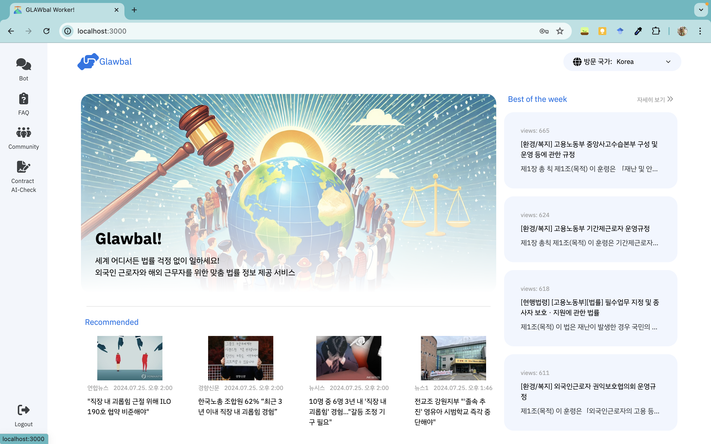
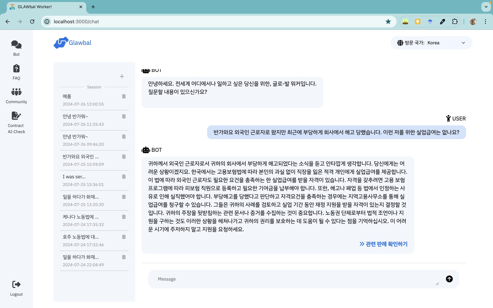

# Glawbal
> 전세계 어디에서나 일하고 싶은 당신을 위한, 글로-발 워커!
* 전세계 외국인 근로자를 위한 RAG 기반 AI 법률 탐색 서비스
* RAG-based AI legal recommendation service for foreign workers around the world

## 1. Introduction
 
 

* 이 Repository는 KT AIVLE SCHOOL 5기 AI트랙 19조의 빅프로젝트 코드 중 FE 파트의 내용을 포함하고 있습니다.
* 본 코드는 FE 코드로, React.js 기반으로 작성되었습니다.

## 2. How to use?
1. **Node.js 설치**
    * 이 레포는 React.js framework를 사용하였으며, Node.js 설치가 선행되어야 실행할 수 있습니다.
2. **터미널에서 npm start 실행**
    * 해당 Repository를 Clone 한 후, 터미널에서 해당 명령어를 실행하면 현재 진행된 프로젝트 결과물을 로컬에서 확인할 수 있습니다.

## 3. Structures
Glawber  
    ├── public  
    ├── src  
    │   ├── Assetts  
    │   │   ├── colors.scss  
    │   │   ├── fonts.scss  
    │   │   └── layout.scss  
    │   ├── Componentts  
    │   │   ├── GBox  
    │   │   ├── GButton  
    │   │   └── GComment  
    │   ├── Layout  
    │   │   ├── Header  
    │   │   ├── SideNavigation  
    │   │   ├── Layout.jsx  
    │   │   └── Layout.scss  
    │   └── Pages  
    │   │   ├── Chatbot  
    │   │   ├── Community  
    │   │   ├── Home  
    │   │   ├── Join  
    │   │   └── Login  
    │   └── index.js  
    ├── .gitignore  
    ├── package.json  
    ├── package-lock.json  
    └── README.md  

## 4. Update Note
* 2024/07/02 (화)
    * Layout 구축 및 Header, SideNavigation 생성
* 2024/07/03 (수)
    * Home 화면 Layout 구축
    * Chatbot 화면, Login 화면 UI 구현